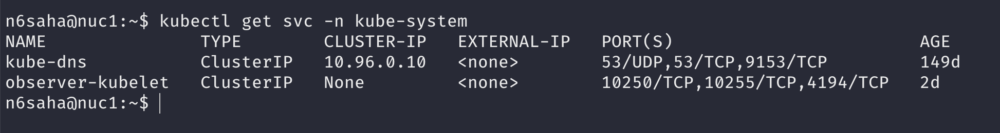
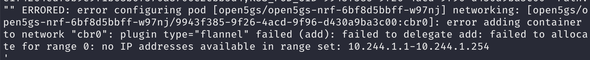
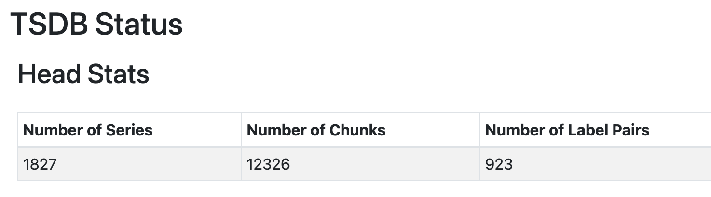

# debugging

## prometheus crashloopbackoff



Caused by duplicate prometheus-kubelet services in kube-system. There should only be one.
Note that helm chart uninstall is not clearing out this service. 

## pods stuck in init
Describe pod state. Check if cni says it is running out of IPs.



Use the clear_cni.sh script to clear out the cni state. This will cause a restart of the cni pods and free up the IPs.

## multus crashloopbackoff
https://github.com/k8snetworkplumbingwg/multus-cni/issues/710#issue-977244895  
Multus can get OOMKilled.
Increase resources for multus pods.

## multus error after reboot

```bash
sudo rm /opt/cni/bin/multus-shim
```
then reboot

## prometheus crashloopbackoff
Prometheus can get OOMKilled if it is collecting too many series.



Reduce high-cardinality metrics or increase resources for prometheus pods.