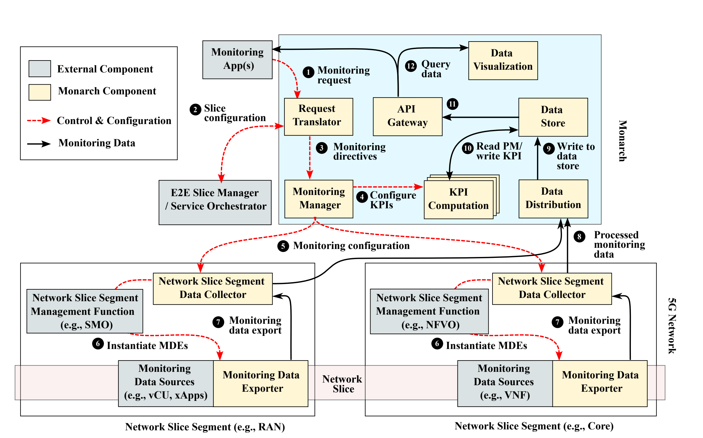
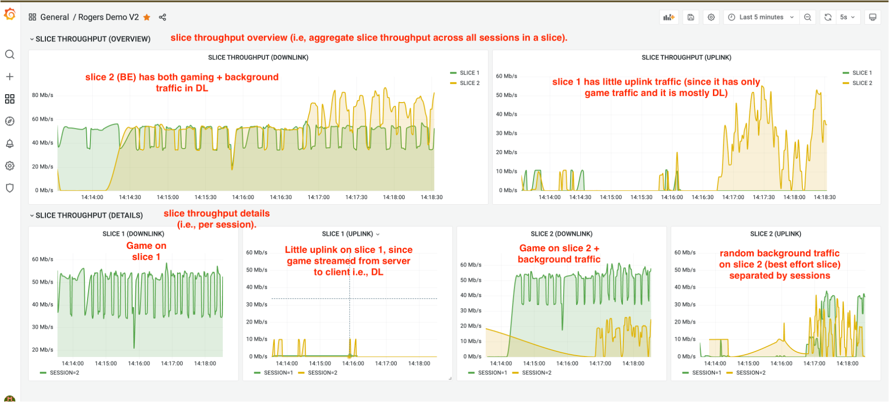

# 5G-Monarch

 

**5G-Monarch** is a network slice monitoring architecture for cloud native 5G network deployments. This repository contains the source code and configuration files for setting up 5G-MonArch, in conjunction with a 5G network deployment.



The figure above shows the conceptual architecture of Monarch. Monarch is designed for cloud-native 5G deployments and focuses on network slice monitoring and per-slice KPI computation.

## Downloads
- [NOMS'23 Paper](https://niloysh.github.io/papers/conferences/2023-noms-monarch.pdf)
- [TNSM'24 Paper](https://niloysh.github.io/papers/journals/2024-tnsm-monarch.pdf)
- [KPI Monitoring Video](https://www.youtube.com/watch?v=pIMBCwPs0wc)

## Table of Contents
- [5G-Monarch](#5g-monarch)
  - [Downloads](#downloads)
  - [Table of Contents](#table-of-contents)
- [Hardware Requirements](#hardware-requirements)
- [Prerequisites](#prerequisites)
    - [Step 1: Deploy a 5G Network with Network Slicing Support](#step-1-deploy-a-5g-network-with-network-slicing-support)
    - [Step 2: Verify Network Slice Deployment](#step-2-verify-network-slice-deployment)
- [Quick Start](#quick-start)
  - [Detailed Deployment Guide](#detailed-deployment-guide)
- [Visualizing network slices KPIs using Monarch](#visualizing-network-slices-kpis-using-monarch)
- [Citation](#citation)
- [Contributions](#contributions)

# Hardware Requirements
- Supported OS: **Ubuntu 22.04 LTS** (recommended) or Ubuntu 20.04 LTS
- Minimum Specifications: **8 cores, 16 GB RAM**


# Prerequisites

### Step 1: Deploy a 5G Network with Network Slicing Support

The [open5gs-k8s](https://github.com/niloysh/open5gs-k8s) repository contains the source code and configuration files for deploying a 5G network using Open5GS on Kubernetes. Please follow the detailed instructions in the open5gs-k8s repository to set up your 5G network.

> [!NOTE]
> To enable metrics collection for monitoring purposes, select the [Deployment with Monarch](https://github.com/niloysh/open5gs-k8s?tab=readme-ov-file#2-deployment-with-monarch-for-monitoring) option while deploying open5gs-k8s.

### Step 2: Verify Network Slice Deployment

After deploying the 5G network, ensure that two network slices have been successfully configured by performing a [ping test to verify connectivity](https://github.com/niloysh/open5gs-k8s?tab=readme-ov-file#step-5-test-connectivity). This step confirms that the network is functioning correctly and is ready for Monarch deployment.

# Quick Start
To quickly set up the Monarch system, follow these steps:

```bash
git clone https://github.com/niloysh/5g-monarch.git
cd 5g-monarch
./deploy-all.sh
```
This script will deploy all core and external components needed for Monarch in a single step.

## Detailed Deployment Guide
For a step-by-step deployment process, including individual component setup and configuration, refer to the [deployment slides](https://niloysh.github.io/5g-monarch/slides.pdf).

# Visualizing network slices KPIs using Monarch

The dashboard below shows Monarch being used to monitor network slices for a cloud-gaming use-case during a [demo at the University of Waterloo](https://uwaterloo.ca/news/researching-cutting-edge-5g-network-slicing-technology). 



# Citation


If you use the code in this repository in your research work or project, please consider citing the following publication.

> N. Saha, N. Shahriar, R. Boutaba and A. Saleh. (2023). MonArch: Network Slice Monitoring Architecture for Cloud Native 5G Deployments. In Proceedings of the IEEE/IFIP Network Operations and Management Symposium (NOMS). Miami, Florida, USA, 08 - 12 May, 2023.


# Contributions
Contributions, improvements to documentation,  and bug-fixes are always welcome!
See [first-contributions](https://github.com/firstcontributions/first-contributions).


