# 5G-Monarch

 

**5G-Monarch** is a network slice monitoring architecture for cloud native 5G network deployments. This repository contains the source code and configuration files for setting up 5G-MonArch, in conjunction with a 5G network deployment.

[](https://www.youtube.com/watch?v=pIMBCwPs0wc) [](https://niloysaha.me/papers/conferences/2023-noms-monarch.pdf)

## Deploying a 5G network


The first step involves deploying a 5G network with support for network slicing. The [open5gs-k8s](https://github.com/niloysh/open5gs-k8s) repository contains the source code and configuration files for deploying a 5G network using Open5GS on Kubernetes. Please follow the instructions in the repository to deploy a 5G network.

**Note 1**: For metrics support, we will use the [msd/overlays/open5gs-metrics](https://github.com/niloysh/open5gs-k8s/tree/6c9ec7d2b1516ffd474c65ca7c7136bd5db41ccb/msd/overlays/open5gs-metrics) overlay, during the deployment of the 5G network.

**Note 2**: We will use the `ueransim-gnb` and `ueransim-ue` directories inside the `msd` folder to deploy the UERANSIM gNB and UE, respectively.

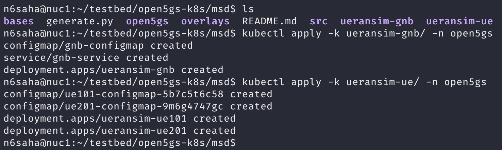


**Note 2**: Please ensure that the 5G network deployment with 2 network slices is successful by doing a ping test as shown the the [open5gs-k8s README](https://github.com/niloysh/open5gs-k8s/blob/6c9ec7d2b1516ffd474c65ca7c7136bd5db41ccb/README.md) before proceeding further with Monarch deployment.

At this point, you should have a 5G network deployed with 2 network slices, and be able to ping through the UEs as shown below.

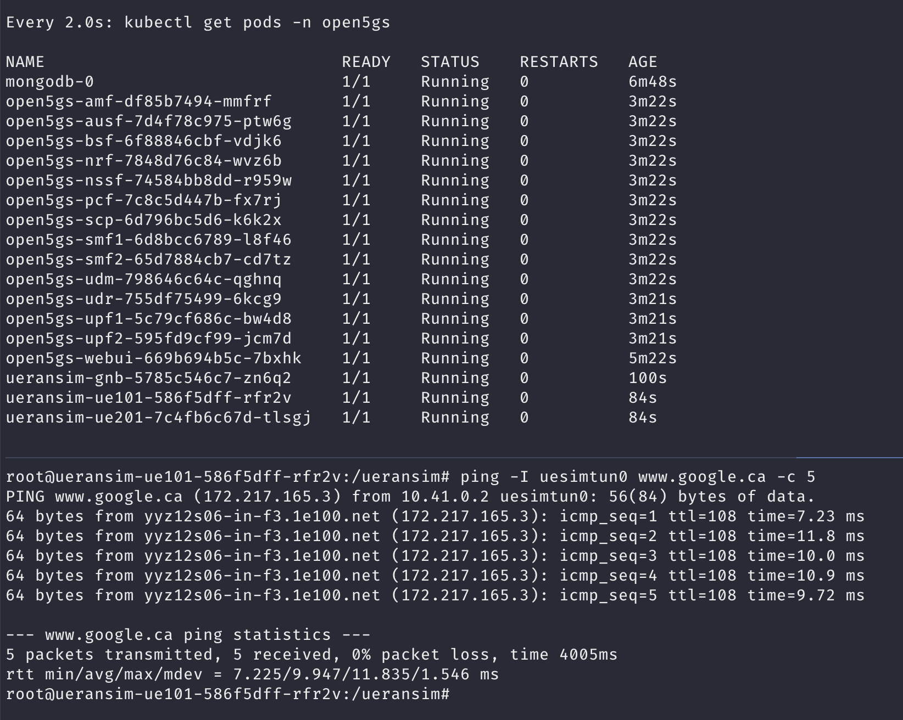

## Deploying Monarch

**Note**: The deployment instructions assume a working kubernetes cluster with open5gs-k8s deployed.

To deploy Monarch, follow the deployment steps below:

### Step 1: Deploy Monarch External Components

Deploy the Monarch external components (i.e., [service_orchestrator](service_orchestrator) and [nfv_orchestrator](nfv_orchestrator), in that order). These are mock components that simulate the functionality of the actual orchestrators. These should be left running, e.g., by using screen or tmux. Monarch's [request_translator](request_translator) and [monitoring_manager](monitoring_manager) components rely on these external components to be available. To deploy the service_orchestrator component, run the following commands (and similarly for nfv_orchestrator):
```bash
cd service_orchestrator
python3 run.py
```
**Note**: You may need to install the required python packages e.g., flask, requests, etc.

### Step 2: Deploy the Data Store

Deploy the [data_store](data_store) component. Most of the Monarch components include a `install.sh` and `uninstall.sh` script for easy deployment and removal. Please run the `install.sh` script from the appropriate directory. For example, to deploy the data_store component, run the following commands:
```bash
cd data_store
./install.sh
```
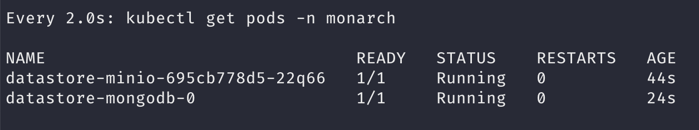

Next, we need to create the access key and secret key for the Minio component of the data store, using the Minio GUI.
We can access the Minio GUI at http://localhost:30713 and use the default credentials of `user: admin` and `password: monarch-operator`. 

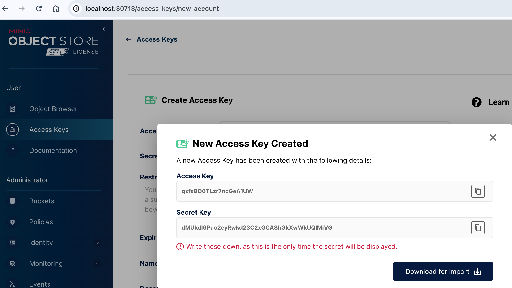

**Note**: Note down the access key and secret key for use in the next step.

### Step 3: Deploy the NSSDC

The third step is the [nssdc](nssdc) deployment. First, we need to create a `.env` file in the repository root to store environment variables such as the Minio access key and secret key. 

```bash
~/5g-monarch$ touch .env
```

Populate the following environment variables in the `.env` file:
```bash
MONARCH_MINIO_ENDPOINT="<node_ip>:30712"  # Update with the node IP of the Kubernetes host
MONARCH_MINIO_ACCESS_KEY=""  # Access key from Minio GUI
MONARCH_MINIO_SECRET_KEY=""  # Secret key from Minio GUI
MONARCH_MONITORING_INTERVAL="1s"
```

Next, deploy the NSSDC using the `install.sh` script:
```bash
cd nssdc
./install.sh
```
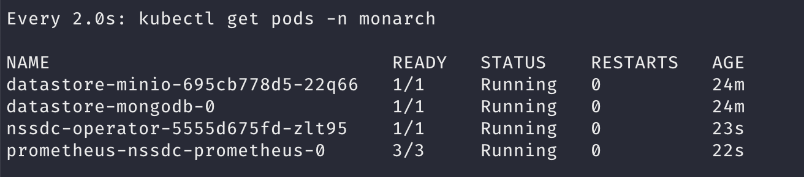

### Step 4: Deploy the Data Distribution Component
The next step is deploying the [data_distribution](data_distribution) component. First, we need to populate some environment variables in the `.env` file:
```bash
MONARCH_THANOS_STORE_GRPC="<node_ip>:30905"
MONARCH_THANOS_STORE_HTTP="<node_ip>:30906"
```

**Note**: These ports are defined in the [nssdc/values.yaml](nssdc/values.yaml) file.

After populating the environment variables, deploy the data_distribution component using the `install.sh` script:
```bash
cd data_distribution
./install.sh
```
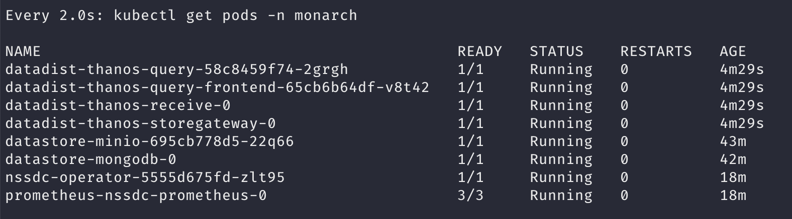

After successful deployment of the data_distribution component, we can access the Thanos GUI at http://localhost:31004, and verify that the nssdc sidecar has been successfully discovered.

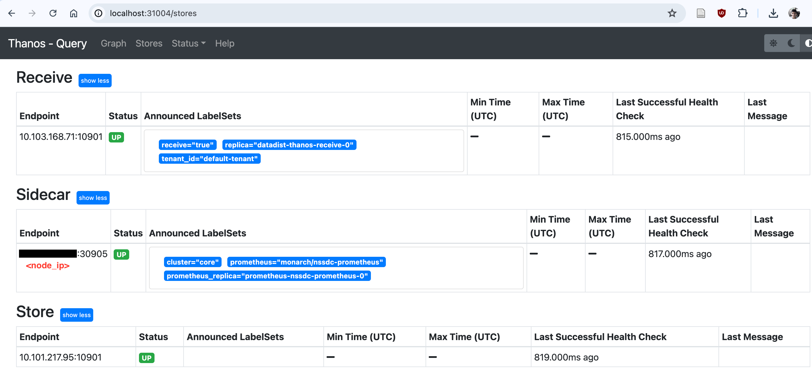

### Step 5: Deploy the Data Visualization Component

The fifth step is deploying the [data_visualization](data_visualization) component, using the `install.sh` script:
```bash
cd data_visualization
./install.sh
```
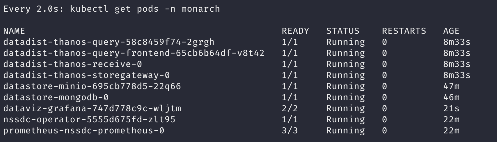

After successful deployment of the data_visualization component, we can access the Grafana GUI at http://localhost:32005, and login with the default credentials of `admin:prom-operator`.

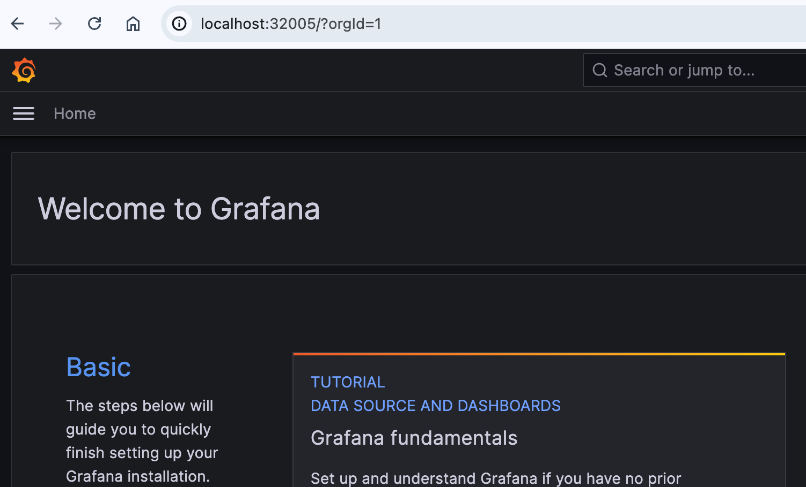

### Step 6: Deploy the Monitoring Manager

Step 6 is deploying the [monitoring_manager](monitoring_manager) component. First, we need to populate some environment variables in the `.env` file:
```bash
NFV_ORCHESTRATOR_URI="http://<node_ip>:6001"
```
**Note**: Make sure that the NFV orchestrator is running at the specified URI (Step 1).

Next, deploy the monitoring_manager component using the `install.sh` script:
```bash
cd monitoring_manager
./install.sh
```
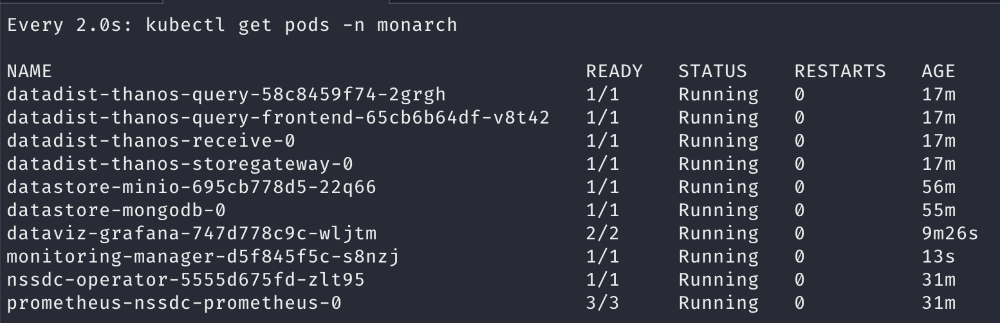

### Step 7: Deploy the Request Translator

Next, we deploy the [request_translator](request_translator) component. First, we need to populate some environment variables in the `.env` file:
```bash
SERVICE_ORCHESTRATOR_URI="http://<node_ip>:5001"
```
**Note**: Make sure that the service orchestrator is running at the specified URI (Step 1).

Next, deploy the request_translator component using the `install.sh` script:
```bash
cd request_translator
./install.sh
```
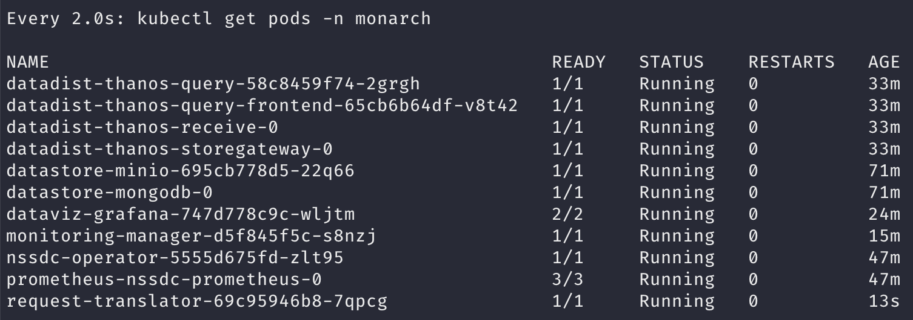

### Step 8: Configure Datasources and Dashboards in Grafana

Step 8 involves configuring datasources and adding dashboards to Grafana. We can do this using the Grafana GUI (Step 5).

First, we need to add the Monarch datadist (Thanos) datasource. Click on Home->Connections->Data Sources->Add new data source. Populate the following fields:

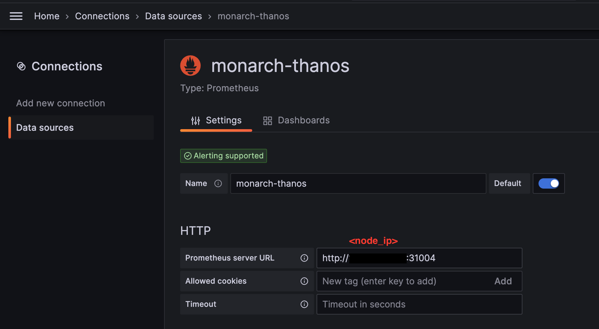
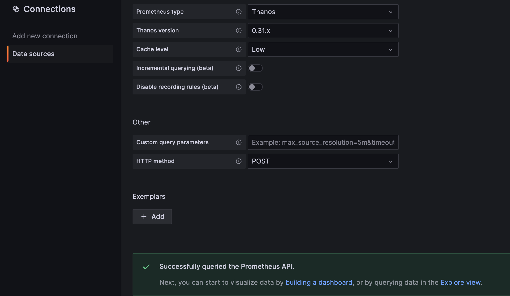

We can import a pre-configured dashboard for monitoring two network slices. Click on Home->Dashboards->New->Import. Use the [monarch-dashboard.json](dashboards/monarch-dashboard.json) file.

### Step 9: Submit a Slice Monitoring Request

The final step involves submitting a slice monitoring request to the request translator. On successful submission, MDEs and KPI computation will be triggered, and the results will be displayed in the Grafana dashboard.

To submit a slice monitoring request, we can use the `test_api.py` script in the [request_translator](request_translator) directory. 
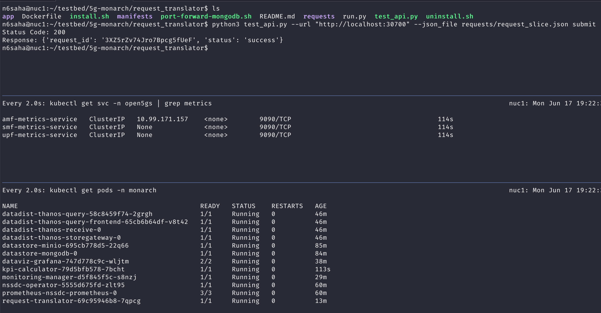

We can see the creation of the metrics-service (MDE) and KPI computation components. Now all Monarch components are up and running.

### Step 10: Send Traffic through the UEs

If we send traffic through the UEs, we can see the KPIs being computed in the Grafana dashboard that we imported. The Grafana dashboard will be updated with the computed KPIs for the two network slices.
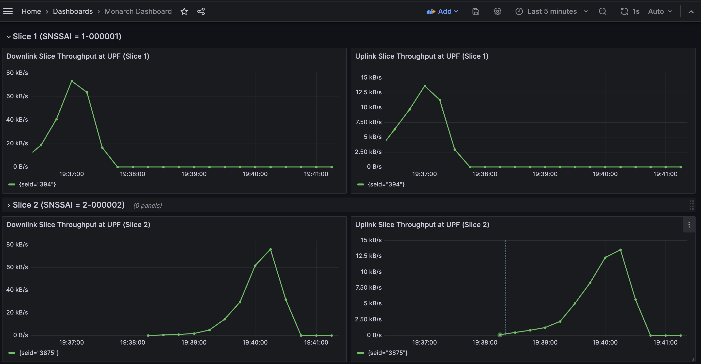. 

**Note**: Use the `uesimtun0` interface for the UEs to send traffic through the network slices.

## Visualizing network slices KPIs using Monarch

The dashboard below shows Monarch being used to monitor network slices for a cloud-gaming use-case during a [demo at the University of Waterloo](https://uwaterloo.ca/news/researching-cutting-edge-5g-network-slicing-technology). 


## Citation


If you use the code in this repository in your research work or project, please consider citing the following publication.

> N. Saha, N. Shahriar, R. Boutaba and A. Saleh. (2023). MonArch: Network Slice Monitoring Architecture for Cloud Native 5G Deployments. In Proceedings of the IEEE/IFIP Network Operations and Management Symposium (NOMS). Miami, Florida, USA, 08 - 12 May, 2023.


## Contributions
Contributions, improvements to documentation,  and bug-fixes are always welcome!
See [first-contributions](https://github.com/firstcontributions/first-contributions).


