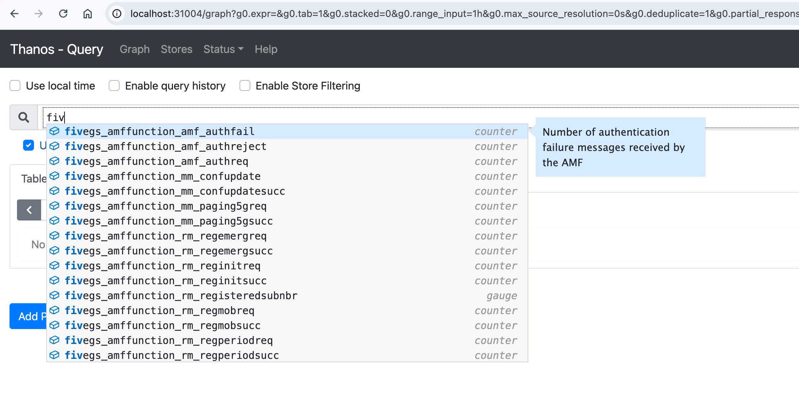

# Lab: Using Thanos Query to access 5G network metrics

In this lab, you will use the Thanos Query API to retrieve and analyze key 5G metrics. Thanos Query is a powerful tool that aggregates and queries metrics from different NSSDC (Prometheus) instances (e.g., edge, core, RAN), providing insights into network performance, subscriber statistics, and more.

### Lab Objectives

- Learn to navigate and use the Thanos Query API for 5G metrics.
- Query metrics related to registered subscribers and session IDs.
- Cross-reference metrics with data in Grafana.

## Getting Started

### 1. Access the Thanos Query API
- Open your browser and navigate to the Thanos Query API at http://localhost:31004/.



- The interface provides autocomplete suggestions (as shown above), which can help you find and complete metric names. Each metric also includes a brief description for clarity.


### 2. Familiarize Yourself with the Interface

- Take a moment to explore the available metrics. Notice that the autocomplete suggestions show descriptions for each metric, which can help you understand what each metric tracks.

> [!TIP]
>  Look for keywords like 5g, smf, subscriber, or session to quickly find relevant metrics for this lab.

## Task 1: Retrieve the Number of Registered Subscribers

- Use the autocomplete to search for the metric `fivegs_amffunction_rm_registeredsubnbr`. This metric tracks the number of registered subscribers in each slice.

- Note the output. How many registered subscribers are there in each slice? 

### Task 2: Retrieve Session IDs for Each Slice

- To locate session information, look at metrics from the Session Management Function (SMF). The SMF manages session IDs, which are essential for tracking connections across slices.
- Search for SMF-related metrics in the Thanos Query API. Look for metrics that include terms like session, id, or slice.
- Query the metric that shows session IDs and note down the session IDs associated with each slice. Compare these session IDs with those displayed in the Grafana dashboard. Do they match?


### Task 3: Using the Thanos HTTP API with Python

Using Python’s HTTP requests library, you can programmatically access Thanos metrics for more flexible data manipulation and analysis. This approach lets you combine, filter, and analyze metrics, which is especially useful for complex metrics like resource utilization across network functions.
1.	Open [exercise.py](exercise.py): This file contains a skeleton of code for **Tasks 3 through 5**.
2.	Structure of the Exercise Code:
	- `query_prometheus`: Sends a Prometheus query to the Thanos HTTP API.
	- `parse_numeric_value_from_prometheus_response`: Parses numeric results from the API response.
	- `parse_data_from_prometheus_response`: Parses return data (raw) from the API response.

3. Example query in python

In exercise.py you will find the following snippet, showing an example of using the HTTP API.

```python
query = 'fivegs_amffunction_rm_registeredsubnbr'
response = query_prometheus(query)
print(response)
```

**Task**: Try running this code to see the raw JSON response from the API.

### Task 4: Retrieve VNFM Metrics for Resource Utilization

1.	**Pod Status and Resource Utilization**: VNFM metrics can provide insights into the health of 5G network functions by monitoring the status of Kubernetes pods and resource utilization.

2.	**Query Example**: Query metrics like `kube_pod_info` and `kube_pod_container_resource_requests` to get details about the network functions' CPU and memory usage.

**Exercise**: Modify the code to retrieve CPU and memory usage data, then parse and display it in a readable format.


### Task 5: Compose Slice-Level KPIs


We've already explored examples of slice-level metrics, like `slice_throughput`. Our KPI computation module leverages the Python HTTP API to query raw metrics, calculate KPIs at the slice level, and store them back in a `data_store`, making them accessible for visualization in Grafana.

In this exercise, you'll dive deeper into composing slice-level metrics, specifically focusing on calculating resource utilization for slice 1 (with SNSSAI=1-000001). You'll combine multiple queries to determine memory usage, providing a practical understanding of how to build KPIs from various metric sources.

1. Retrieve Memory Requests:
    - Query kube_pod_container_resource_requests to get memory requests for SMF1 and UPF1.
    - Parse and store these values.
2. Retrieve Memory Usage:
    - Use `avg_over_time(container_memory_working_set_bytes{pod=~".*smf1.*"}[5m])` to find the 5-minute average memory usage for SMF1.
	- Do the same for UPF1.
3. Calculate the Percentage:
    - Sum the memory requests and usage for both SMF1 and UPF1.
	- Calculate the percentage of requested memory currently being used.

