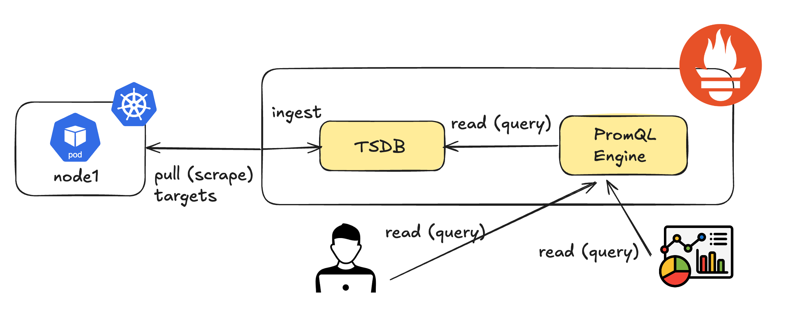

# Lab 2: Querying Prometheus using PromQL


In this lab, you will learn how to query Prometheus for metrics using the PromQL language.

- **What is PromQL** – What it is and how it works
- **Filtering and Aggregation** – How to expose application data to Prometheus

---
# PromQL: The Query Language for Prometheus

Prometheus requires a query language to interact with stored metrics, enabling users to:
- Gain **ad-hoc insights** from the data
- Build **visualizations** and **dashboards**


This language is called **PromQL** and provides an open standard unified way of **selecting**, **aggregating**, **transforming**, and **computing** on the collected time series data. 

---
# Prometheus Query Engine
If we take a look at the Prometheus internals, we find that the ingested time series data (metrics) are scraped from configured targets and stored in a Time Series DataBase (TSDB). An internal PromQL engine supports our ability to query that data.



---
# PromQL Terminology


- **Query** - a PromQL query is not like `SQL (SELECT * FROM...)`, but consist of nested functions with each inner function returning the data described to the next outer function. An example query is given below.

    ```bash
    avg(rate(http_requests_total{status="200"}[5m])) by (job)
    ```

- **Aggregation** - using operators that support combining elements from a single function, resulting in new results with fewer elements by combining values e.g., `(SUM, MIN, MAX, AVG...)`

- **Filtering** - the act of removing metrics from a query result by exclusion, aggregation, or applying language functions to reduce the results.

Queries can be sent externally to Prometheus using the **Prometheus API (HTTP)**. 

---
# PromQL - Selecting a Metric

We can find all the metrics available for the sample application using the Prometheus expression browser available at [http://localhost:30095](http://localhost:30095).

Use `workshop_response_time_seconds` in the expression browser.

The metric `workshop_response_time_seconds` selects all `LABELS` associated with it. In this case they are `instance`, `job`, `region`, `service`. Your results should look something like this:


---
# PromQL - Filtering using Labels

We can narrow down the results using one or more labels. Try the following query with two labels filtering your results:
```
workshop_response_time_seconds{region="us-east", service="auth_service"}
```

**Matching Operators**
So far, we have only looked at Equals operator. Try experimenting with the operators below.
```
=: Equals
!=: Not Equals
=~: Regular expression (Regex) match
!~: Regular expression (Regex) non-match
```
---
# PromQL - Exploring 5G Metrics

If you have submitted a monitoring request, and MDEs are installed you should see the targets for AMF, SMF 

- Take a moment to explore the available metrics. Notice that the autocomplete suggestions show descriptions for each metric, which can help you understand what each metric tracks.

> [!TIP]
>  Look for keywords like 5g, smf, subscriber, or session to quickly find relevant metrics for this lab.
