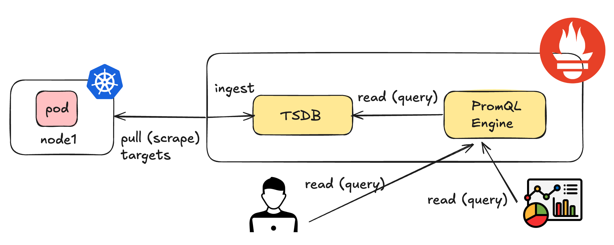
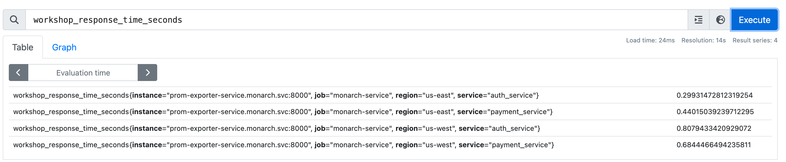
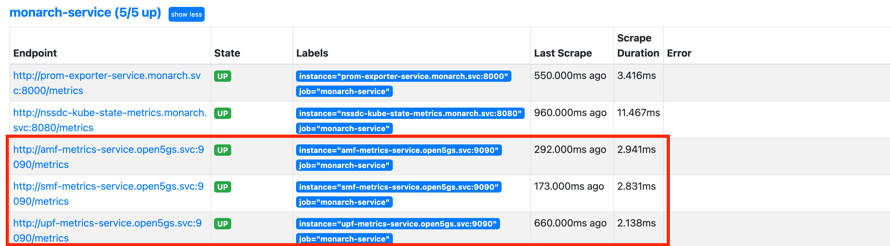

# Lab 2: Querying Prometheus using PromQL


In this lab, you will learn how to query Prometheus for metrics using the PromQL language. Specifically, you will learn the following:

- **What is PromQL** – Basics of Prometheus Query Language
- **Filtering and Aggregation** – Using PromQL labels and functions
- **Querying 5G metrics** - How to use PromQL to query 5G metrics

---
# PromQL: The Query Language for Prometheus

Prometheus requires a query language to interact with stored metrics, enabling users to:
- Gain **ad-hoc insights** from the data
- Build **visualizations** and **dashboards**


This language is called **PromQL** and provides an open standard unified way of **selecting**, **aggregating**, **transforming**, and **computing** on the collected time series data. 

---
# Prometheus Query Engine
If we take a look at the Prometheus internals, we find that the ingested time series data (metrics) are scraped from configured targets and stored in a Time Series DataBase (TSDB). An internal PromQL engine supports our ability to query that data.



---
# PromQL Terminology


- **Query** - a PromQL query is not like `SQL (SELECT * FROM...)`, but consist of nested functions with each inner function returning the data described to the next outer function. An example query is given below.

    ```bash
    avg(rate(http_requests_total{status="200"}[5m])) by (job)
    ```

- **Aggregation** - using operators that support combining elements from a single function, resulting in new results with fewer elements by combining values e.g., `(SUM, MIN, MAX, AVG...)`

- **Filtering** - the act of removing metrics from a query result by exclusion, aggregation, or applying language functions to reduce the results.

Queries can be sent externally to Prometheus using the **Prometheus API (HTTP)**. 

---
# PromQL - Selecting a Metric

We can find all the metrics available for the sample application using the Prometheus expression browser available at [http://localhost:30095](http://localhost:30095).

Use `workshop_response_time_seconds` in the expression browser.

The metric `workshop_response_time_seconds` selects all `LABELS` associated with it. In this case they are `instance`, `job`, `region`, `service`. Your results should look something like this:



---
# PromQL - Filtering using Labels

We can narrow down the results using one or more labels. Try the following query with two labels filtering your results:
```
workshop_response_time_seconds{region="us-east", service="auth_service"}
```

**Matching Operators**
So far, we have only looked at Equals operator. Try experimenting with the operators below.
```
=: Equals
!=: Not Equals
=~: Regular expression (Regex) match
!~: Regular expression (Regex) non-match
```

---
# PromQL - Range Vectors
Up till now, you have only executed queries selecting the latest value for all series found, which is known as an `INSTANT VECTOR`. There are PromQL functions that return a range of values, known as a `RANGE VECTOR`. These have a duration specified at the end in the form `[number,unit]`. 

Let's look at the example below showing `workshop_response_time_seconds` for the past 5 seconds.

```
workshop_response_time_seconds{region="us-east", service="auth_service"}[5s]
```
Valid duration are `ms` (milliseconds), `s` (seconds), `m` (minutes), `h` (hours), `d` (days), `y` (years)


---
# PromQL - Operations on Data
PromQL allows various functions to perform operations on the data. For example, we can calculate the **per-second change over time in a range vector** using the `deriv()` function. 

```
deriv(workshop_response_time_seconds{region="us-east", service="auth_service"}[5s])
```

**Graph**: Switch to the `Graph` tab in the expression browser, and see the per-second change reprsented visually.


The list of available functions can be found in the [Prometheus docs](https://prometheus.io/docs/prometheus/latest/querying/functions/).

---
# PromQL - Time Shifting Data
Next, let's look at how to select data in the past. 

This is known as **time shifting**.

To do this you append `offset` and a `duration` such as looking at `workshop_response_time_seconds` over 5 seconds back 10 minutes ago:


```
workshop_response_time_seconds{region="us-east", service="auth_service"}[5s] offset 10m
```
---

# PromQL - Exploring 5G Metrics

If you have submitted a monitoring request, and MDEs are installed you should see the targets for AMF, SMF and UPF NFs, as shown below.



Take a moment to explore the available metrics from the expression browser. Look for keywords like `fivegs`, `smf`, `subscriber`, or `session` to quickly find relevant metrics.

---
# PromQL - Filtering using Regex
Let's look at some advanced querying using Regex. Suppose you wanted to look at the CPU usage of the SMF. You could do that by specifying the pod name in the label:

```
container_cpu_usage_seconds_total{pod="open5gs-smf1-<id>"}
```
The problem is that we can have `N` SMF pods for `N` slices, each with a different `<id>`!

We can use a regex to select `container_cpu_usage_seconds_total` for any pod containing `smf`. To match any characters before and after `smf`, we use `.*`, which matches **0 or more of any character**.

```
container_cpu_usage_seconds_total{pod=~".*smf.*"}
```
**Note**: `=~` specifies a regex match.

---
# PromQL - Aggregation

So far you have been visualizing time series data that is highly dimensional. That means you can narrow down your search results using multiple labels.

Now, we are going to look at how you can aggregate over all these dimensions (e.g., labels). To do this, you can you aggregation functions such as `sum`, `avg`, `min` and `max`.

Note that these operators do not aggregate over time, but **across multiple series at each point in time**.

For example, now we can sum up our CPU usage of the SMF as follows:

```
sum(container_cpu_usage_seconds_total{pod=~".*smf.*"})
```

---
# PromQL - Exercises

## Task 1: Retrieve the Number of Registered Subscribers

Search for the metric `fivegs_amffunction_rm_registeredsubnbr`. This metric tracks the number of registered subscribers in each slice.

**Question**: How many registered subscribers are there in each slice? 

## Task 2: Retrieve Session IDs for Each Slice

The SMF manages session IDs (`seid`), which are essential for tracking connections across slices. Query the metric that shows session IDs. 

**Question**: Which session IDs are associated with slice 1 with `SNSSAI=1-000001`?

---
# Next Steps

**Congratulations!**
You've successfully completed the following:
- Learned about the basics of PromQL.
- Learned about instant and range vectors and how to perform operations on data using PromQL functions.
- Explored 5G metrics scraped by Prometheus.

**What's Next?**
Continue to [Lab 3](https://niloysh.github.io/5g-monarch/labs/lab3/README.pdf) to learn about using Prometheus HTTP API using Python to easily execute more complex operations.