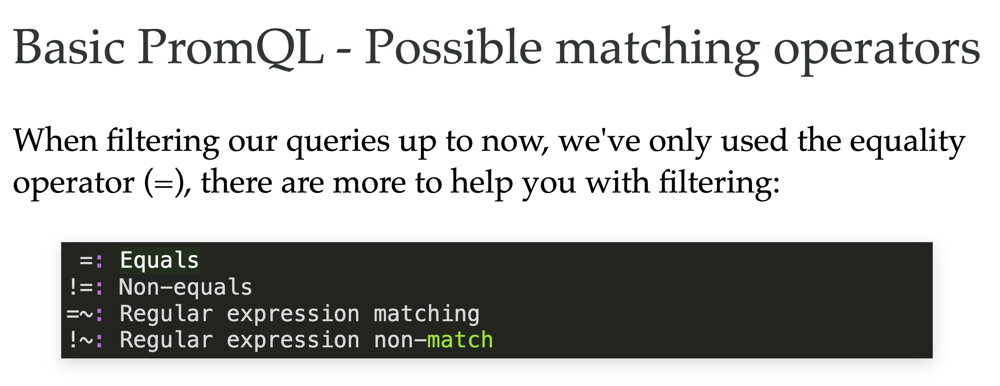
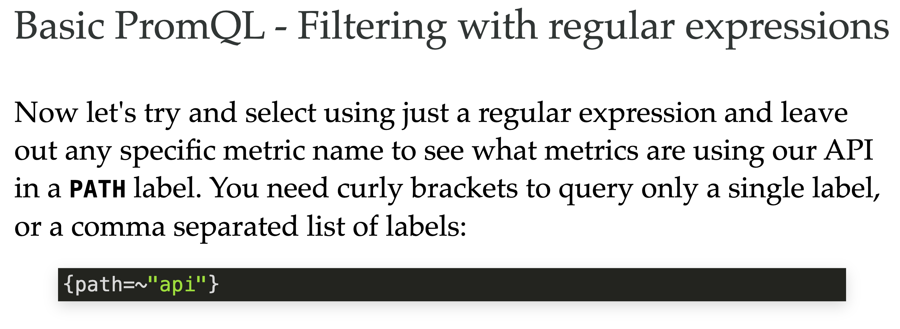
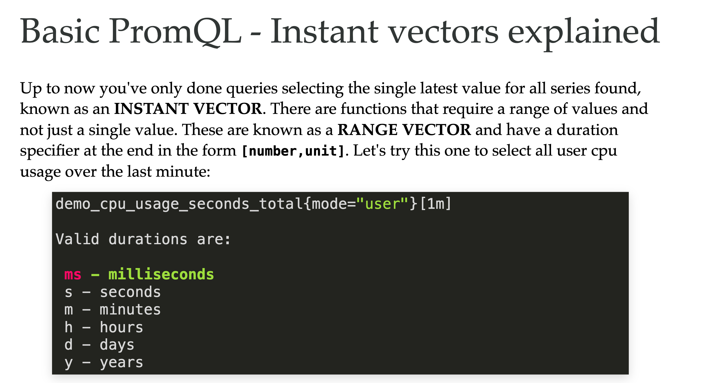
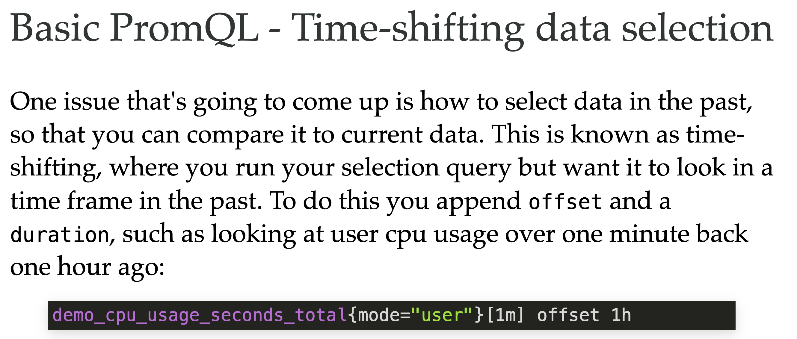
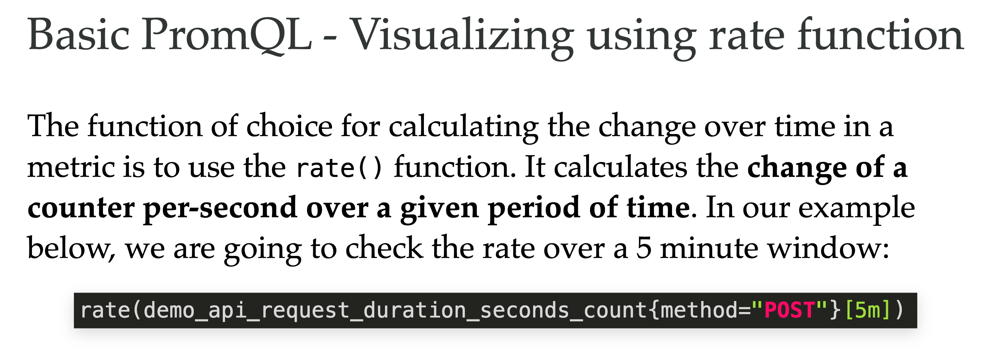
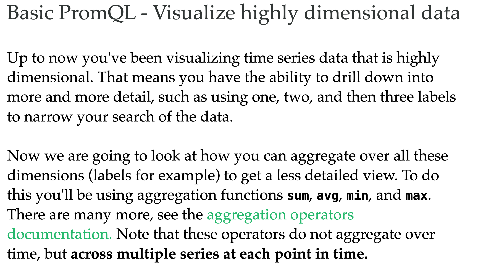

A query language is needed by Prometheus to be able to send requests to the stored metrics data, allowing users to gain ad-hoc insights, build visualizations and dashboards from this data, and be able to report (alert) when incoming data indicates that systems are not performing as desired.

This language is called PromQL and provides an open standard unified way of selecting, aggregating, transforming, and computing on the collected time series data. Note that this language provides only READ access to the collected metrics data, while Prometheus offers a different path to WRITE access.
PromQL - Proving PromQL compliance?
PromQL is an open standard in that it's widely integrated by many vendors in their products, which begs the question, how can I be sure that a product is 100% compatible with the real open source PromQL found in the Prometheus project?

To answer this question, the PromQL Compliance Tester was added to the larger Prometheus compliance project. Follow the documentation and you can test any vendor you like, or you can browse one of the formatted results published online.
PromQL - Compliance testing results
You can see here that Chronosphere has full compliance with the Prometheus Query Language and you can view the entire output of the compliance tests online:
compliance

Taking a closer look here at our Prometheus internals, we find the ingested time series data (metrics) are scraped from configured targets and stored in the TSDB. An internal PromQL engine supports our ability to query that data. All queries are in read-only access. The query engine supports both internal and external queries. Let's take a look at some rule terminology before we dig any further:

Before we get too deep into PromQL, let's look closer at the various rule terminology you'll be covering. First a query and rule:

## Ad-hoc/Simple Queries

This use case is about you running live queries against the collected time series data. Imagine you are getting alerts while on-call at your organization, you open the dashboard and the pre-configured display gives you some hints as to the issue but you want to dig specifically into some data points. That's when you write your own ad-hoc query and execute it to view the data in a graph

## Dashboards
This use case is where you create a layout of queries in what is know as a dashboard. You design your display of metrics, gauges, and charts you want to display for a specific user viewing aspects of your systems. PromQL queries are used to collect data. We use Grafana.

## Demo

The services demo architecture shows the layout, but what are these services providing for our Prometheus instance to collect metrics from? It's exporting synthetic metrics (specifically designed metrics) about our simulated services, here's a few examples:

HTTP API server exposing request counts and latencies
Periodic batch job exposing timestamp and number of processed bytes
Metrics: CPU usage, memory usage, size of disk, disk usage, and more

## Cont
A quick review: Be sure you've completed the previous lab before proceeding.

If you've done that, then you now have Prometheus installed, configured, and running (maybe for some time now) collecting time series data known as metrics. You've also built and installed the services demo project to provide a service that Prometheus scrapes for a varied data collection. This involved re-configuring Prometheus to scrape the new services instance and a restart. The longer this setup is running, the more data your queries will display as the graph views can be adjusted by time intervals.

In this lab, you'll start using the query language and see what we can find out from our metrics data collection.

---
Basic PromQL - Starting with selecting metrics
The basic first step to querying your metrics data collection (time series data) is to select some portion of that data. You have to start somewhere, with a basic selection, before you move to transforming or performing calculations on your selected data.

When you select some metric, you are going to start by selecting all instances of that metric with no filtering at all. The second step will be to filter based on a metric NAME and one or more of its LABELS.
Basic PromQL - A few definitions before querying

---
Let's look at what you are going to be doing in your first basic queries:
Metric name - querying for all time series data collected for that metric

Label - using one or more assigned labels filters metric output

Timestamp - fixes a query single moment in time of your choosing

Range of time - setting a query to select over a certain period of time

Time-shifted data - setting a query to select over a period of time while adding an offset from the time of query execution (looking in the past)
---
You're going to start with queries targeting the services demo metric names you saw listed when you installed it in the previous lab. You can view all of them and their available labels in your browser at its metrics endpoint http://localhost:8080/metrics:
---
Let's start by selecting the below metric name using the Prometheus expression browser which you can find at http://localhost:9090. Cut-and-paste the below line to select all time series data from our collection in Prometheus:
---
As you can see, the metric demo_api_request_duration_seconds_count selects all LABELS associated with it. In this case they are INSTANCE, JOB, METHOD, PATH, STATUS. Your results should look something like this:
---
Basic PromQL - Filtering using a label
Now we can start filtering our selection output by using a specific label. You might have noticed that the output had two sorts of METHOD, either GET or POST, so we can narrow the output down by half just by selecting one of them as follows:

Basic PromQL - Filtering with multiple labels
To further refine our search we can be more specific by adding more labels to our query. Try the following query with two labels filtering your results:
---

---

---

---

---

---

---

---

Gauges track current tallies, things that increase or decrease over time, such as memory usage or a temperature. A gauge metric is serialized like this: